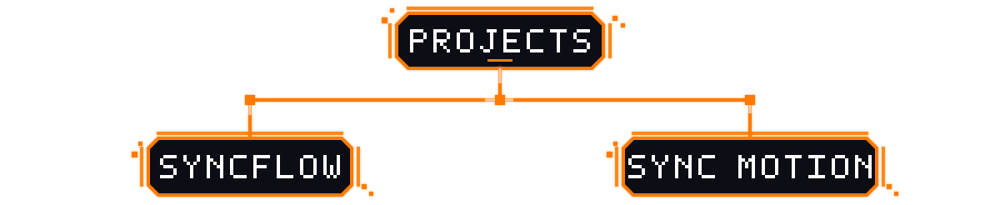
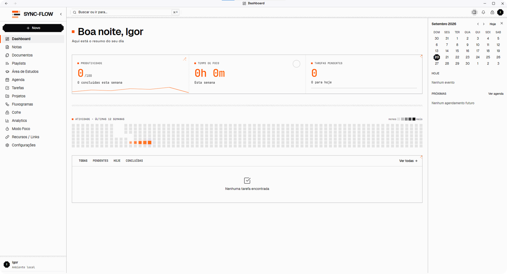
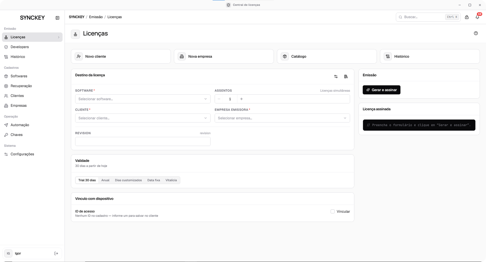
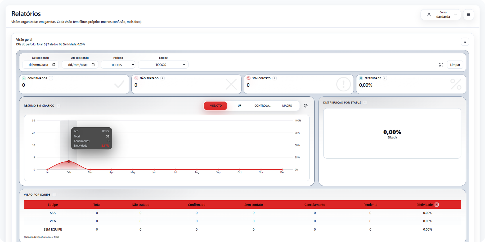
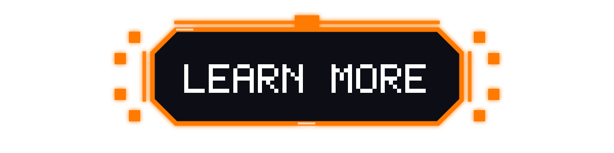

 

  

###

  
  
  
  

###

  

  
  
  
  
  
  
  
  
  
  
  
  
  
  
  
  
  
  
  
  
  
  
  
  
  
  
  
  
  
  
  
  
  
  
  
  
  
  
  
  
  
  
  
  
  
  
  
  
  
  
  
  
  
  
  

###

  

<picture data-importer="pacman">
  <source media="(prefers-color-scheme: dark)" srcset="https://raw.githubusercontent.com/IGORFILADELFO/IGORFILADELFO/pacman-output/pacman-contribution-graph-dark.svg?game=pacman">
  <source media="(prefers-color-scheme: light)" srcset="https://raw.githubusercontent.com/IGORFILADELFO/IGORFILADELFO/pacman-output/pacman-contribution-graph.svg?game=pacman">
  
</picture>

###

  

###

 

###

 

  

<table align="center" width="100%" cellpadding="12" cellspacing="0">
  <tr>
    <td align="center" width="49%" valign="middle">
      
       
    </td>
    <td align="center" width="2%" valign="middle">
      
    </td>
    <td align="center" width="49%" valign="middle">
      
       
    </td>
  </tr>
</table>

  

<table align="center" width="100%" cellpadding="12" cellspacing="0">
  <tr>
    <td align="center" width="49%" valign="middle">
      
       
    </td>
    <td align="center" width="2%" valign="middle">
      
    </td>
    <td align="center" width="49%" valign="middle">
      
       
    </td>
  </tr>
</table>

  

  

 
